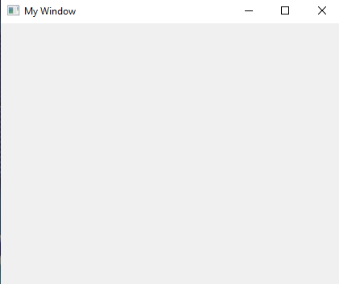

# Membuat Window Pertama (Win32 API)

## A. Deskripsi

Pada proyek ini, kita akan membuat **jendela (window)** pertama menggunakan **Win32 API** tanpa menggunakan framework tambahan.  
Program ini menunjukkan bagaimana cara mendaftarkan class window, membuat window, serta memproses pesan-pesan sistem Windows.

## B. Penjelasan Kode

### 1. Mendaftarkan Class Window (`WNDCLASSW`)

```cpp
WNDCLASSW wc = {0};
wc.hbrBackground = reinterpret_cast<HBRUSH>(COLOR_WINDOW);
wc.hCursor = LoadCursor(NULL, IDC_ARROW);
wc.hInstance = hInst;
wc.lpszClassName = L"firstWindowClass";
wc.lpfnWndProc = WindowProcedure;
```

- `hbrBackground`: Menentukan warna latar belakang window.
- `hCursor`: Menentukan kursor yang akan digunakan (misal: panah default).
- `hInstance`: Handle dari instance program.
- `lpszClassName`: Nama class window.
- `lpfnWndProc`: Alamat fungsi callback untuk memproses pesan.

> **Catatan:** Pada dasarnya ini merupakan struct yang di dalamnya terdapat member/variable.

### 2. Mendaftarkan Kelas ke Sistem

```cpp
if (!RegisterClassW(&wc)) {
    return -1;
}
```

Jika register class gagal, program akan berhenti dengan nilai `-1`.

---

### 3. Membuat dan Menampilkan Jendela

```cpp
CreateWindowW(L"firstWindowClass", L"My Window", WS_OVERLAPPEDWINDOW | WS_VISIBLE, 
              100, 100, 500, 500, NULL, NULL, NULL, NULL);
```

- Nama class (`"firstWindowClass"`) harus sesuai dengan yang telah diregister.
- `"My Window"` adalah judul window.
- `WS_OVERLAPPEDWINDOW | WS_VISIBLE` adalah style window.
- Parameter selanjutnya adalah posisi `(x, y)` dan ukuran `(width, height)`.

---

### 4. Loop Pesan (`Message Loop`)

```cpp
MSG msg = {0};

while (GetMessageW(&msg, NULL, static_cast<UINT>(NULL), static_cast<UINT>(NULL))) {
    TranslateMessage(&msg);
    DispatchMessage(&msg);
}
```

Loop ini terus berjalan untuk menerima pesan dari sistem dan meneruskannya ke fungsi `WindowProcedure`.

---

### 5. Fungsi `WindowProcedure`

```cpp
LRESULT CALLBACK WindowProcedure(HWND hWnd, UINT msg, WPARAM wp, LPARAM lp) {
    switch (msg) {
        case WM_DESTROY:
            PostQuitMessage(0);
            return 0;
        default:
            return DefWindowProcW(hWnd, msg, wp, lp);
    }
    return DefWindowProcW(hWnd, msg, wp, lp);
}
```

- ``DefWindowProcW(hWnd, msg, wp, lp);`` Fungsi bawaan Windows yang menangani semua pesan default (standar) untuk window yang kamu buat. Biasanya di gunakan dengan ``return`` berarti mengembalikan nilai dari pesan.

#### Penjelasan Parameter:
| Parameter    | Deskripsi                                                                 |
|--------------|---------------------------------------------------------------------------|
| `HWND hWnd`  | Handle ke jendela yang menerima pesan.                                    |
| `UINT msg`   | Kode pesan yang dikirim, seperti `WM_DESTROY`, `WM_PAINT`, dll.           |
| `WPARAM wp`  | Data tambahan yang terkait dengan pesan, biasanya berupa integer/flag.    |
| `LPARAM lp`  | Data tambahan lainnya, bisa berupa pointer atau gabungan dua nilai 16-bit.|

- Fungsi ini bertugas menangani pesan-pesan Windows (seperti klik, tutup, dsb).
- `WM_DESTROY` menangani saat window ditutup dan memerintahkan aplikasi keluar dengan `PostQuitMessage(0)`.

---

## C. Hasil

Berikut adalah hasil tampilan window saat program dijalankan:



# 😉Terima Kasih😉
