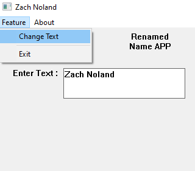

# Membuat Window dengan Input Text (Win32 API)

## A. Deskripsi

Proyek ini membuat sebuah **Window GUI** yang memiliki fitur input teks dan perubahan judul window berdasarkan input tersebut. Program ini dibuat menggunakan **Win32 API**, dan melibatkan penggunaan kontrol seperti `STATIC` dan `EDIT`, serta pemrosesan teks melalui `GetWindowTextW` dan `SetWindowTextW`.

---

## B. Penjelasan Kode

### 1. Identifier dan Handle

```cpp
#define CHANGE_TEXT_FEATURE_MENU 1
#define EXIT_FEATURE_MENU 2
#define ABOUT_MENU 3

HWND hEditOutput;
```

* `#define` digunakan untuk mendefinisikan ID unik dari setiap item menu yang akan digunakan dalam `WM_COMMAND`.
* `hEditOutput` adalah global handle ke kontrol `EDIT` yang akan digunakan untuk mengambil input teks dari user.

---

### 2. Menambahkan Kontrol ke Window (`addControls`)

```cpp
void addControls(HWND hWnd) {
    CreateWindowW(L"STATIC", L"Renamed Name APP", WS_VISIBLE | WS_CHILD | SS_CENTER, 200, 5, 100, 50, hWnd, NULL, NULL, NULL);

    CreateWindowW(L"STATIC", L"Enter Text :", WS_VISIBLE | WS_CHILD | SS_LEFT, 25, 65, 100, 50, hWnd, NULL, NULL, NULL);
    hEditOutput = CreateWindowW(L"EDIT", L".....", WS_VISIBLE | WS_CHILD | WS_BORDER | ES_MULTILINE | ES_AUTOVSCROLL | ES_AUTOHSCROLL, 108, 65, 200, 50, hWnd, NULL, NULL, NULL);
}
```

#### Penjelasan Parameter `CreateWindowW()`:

```cpp
CreateWindowW(L"CLASS", L"TEXT", STYLE, X, Y, WIDTH, HEIGHT, hWnd, HMENU, HINSTANCE, LPVOID);
```

| Parameter         | Penjelasan                                                               |
| ----------------- | ------------------------------------------------------------------------ |
| `L"CLASS"`        | Tipe kontrol, seperti `STATIC` atau `EDIT`.                              |
| `L"TEXT"`         | Teks awal atau label untuk kontrol.                                      |
| `STYLE`           | Kombinasi gaya kontrol, misalnya `WS_VISIBLE`, `WS_CHILD`, `WS_BORDER`.  |
| `X`, `Y`          | Posisi kontrol di dalam Window (dalam piksel).                           |
| `WIDTH`, `HEIGHT` | Ukuran kontrol.                                                          |
| `hWnd`            | Handle ke induk window tempat kontrol ditampilkan.                       |
| `HMENU`           | Biasanya digunakan untuk ID kontrol, diisi `NULL` jika tidak dibutuhkan. |
| `HINSTANCE`       | Handle ke instance aplikasi. Biasanya `NULL` untuk kontrol.              |
| `LPVOID`          | Parameter tambahan. Diisi `NULL` jika tidak digunakan.                   |

* Untuk `EDIT`, digunakan beberapa gaya tambahan seperti `ES_MULTILINE` (mendukung banyak baris), `ES_AUTOVSCROLL` (scroll otomatis vertikal), dan `ES_AUTOHSCROLL` (scroll otomatis horizontal).

---

### 3. Aksi Menu: Mengubah Judul Window

```cpp
case CHANGE_TEXT_FEATURE_MENU:
    wchar_t text[100];

    GetWindowTextW(hEditOutput, text, 100);
    SetWindowTextW(hWnd, text);
    break;
```

#### Penjelasan:

* `wchar_t text[100];` mendeklarasikan buffer untuk menyimpan teks dari kontrol input.

##### `GetWindowTextW(HWND hWnd, LPWSTR lpString, int nMaxCount)`

* Mengambil teks dari kontrol `EDIT`.
* `hEditOutput`: handle ke kontrol `EDIT`.
* `text`: buffer tujuan.
* `100`: jumlah maksimum karakter.

##### `SetWindowTextW(HWND hWnd, LPCWSTR lpString)`

* Mengubah **judul Window utama** menjadi teks yang diinput.
* `hWnd`: handle ke Window utama.
* `text`: string yang akan digunakan sebagai judul.

Fungsi ini menjadikan input pengguna sebagai judul dari aplikasi, menciptakan interaksi dinamis.

---

## D. Hasil

Saat dijalankan, aplikasi akan menampilkan:



* Dua label `STATIC`.
* Satu kotak input `EDIT`.
* Menu bar dengan opsi "feature" (berisi "Change Text" dan "Exit") serta "About".

Jika user mengetikkan teks dan memilih "Change Text", maka title Window akan berubah menjadi teks tersebut.

# 😉 Terima Kasih 😉