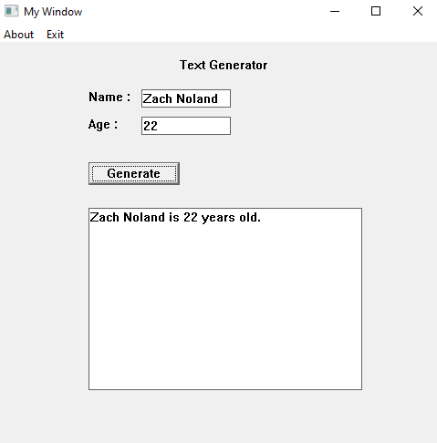

# Membuat Aplikasi Text Generator (Win32 API)

## A. Deskripsi

Proyek ini merupakan aplikasi GUI sederhana menggunakan **Win32 API**, yang memungkinkan pengguna untuk memasukkan **Name** dan **Age**, kemudian menghasilkan kalimat seperti `John is 20 years old.` secara otomatis. Aplikasi juga dilengkapi dengan menu bar interaktif yang berisi opsi `About` dan `Exit`.

---

## B. Penjelasan Kode

### 1. Header

```cpp
#include <iostream>
#include <vector>
#include <windows.h>
```

* `#include <iostream>` digunakan untuk mendukung manipulasi input/output berbasis `std::string` (meskipun tidak digunakan untuk `std::cout`, tetapi dibutuhkan oleh `std::string` internals).
* `#include <vector>` digunakan untuk menyimpan buffer string dari input user dalam bentuk dinamis.
* `#include <windows.h>` adalah header utama untuk akses ke API Windows seperti `CreateWindowW`, `MessageBoxA`, dan lainnya.

---

### 2. Makro ID untuk Menu dan Button

```cpp
#define ABOUT_MENU 1
#define EXIT_MENU 2
#define GENERATE_BUTTON 3
```

Makro ini digunakan untuk mengidentifikasi elemen UI saat pesan `WM_COMMAND` dikirim. Nilai ini dibedakan agar setiap aksi dapat ditangani secara spesifik di dalam `WindowProcedure`.

---

### 3. Komponen Global

```cpp
HWND hName, hAge, hOutput;
```

* `hName`: Menyimpan handle untuk input teks nama.
* `hAge`: Menyimpan handle untuk input teks umur.
* `hOutput`: Menyimpan handle untuk menampilkan hasil kalimat.

---

### 4. Fungsi addControls

```cpp
void addControls(HWND hWnd);
```

Fungsi ini menambahkan semua komponen UI berupa **STATIC**, **EDIT**, dan **BUTTON**.

```cpp
CreateWindowW(L"STATIC", L"Name :", ...);
hName = CreateWindowW(L"EDIT", ...);
```

* Menampilkan label "Name:" dan menyediakan `EDIT` box untuk input.

```cpp
CreateWindowW(L"STATIC", L"Age :", ...);
hAge = CreateWindowW(L"EDIT", ...);
```

* Menampilkan label "Age:" dan menyediakan `EDIT` box.

```cpp
CreateWindowW(L"BUTTON", L"Generate", ..., (HMENU)GENERATE_BUTTON, ...);
```

* Tombol dengan teks `Generate` yang saat diklik akan memicu event di `WM_COMMAND`.

```cpp
hOutput = CreateWindowW(L"EDIT", L"No Output", ...);
```

* Output box tempat hasil teks ditampilkan.

---

### 5. Penanganan Event pada `WM_COMMAND`

```cpp
case GENERATE_BUTTON:
    std::vector<char> NameBuffer(30), AgeBuffer(10);

    GetWindowTextA(hName, NameBuffer.data(), NameBuffer.size());
    GetWindowTextA(hAge, AgeBuffer.data(), AgeBuffer.size());

    std::string Name(NameBuffer.data());
    std::string Age(AgeBuffer.data());
    std::string Output = Name + " is " + Age + " years old.";

    SetWindowTextA(hOutput, Output.c_str());
    MessageBeep(MB_OK);
    break;
```

* `GetWindowTextA`: Mengambil teks dari `EDIT` box `hName` dan `hAge`.
* Data disimpan dalam `std::vector<char>` sebagai buffer.
* Buffer diubah menjadi `std::string` untuk kemudahan manipulasi.
* Kalimat hasil digabung menggunakan operator `+`.
* `SetWindowTextA`: Menampilkan hasil ke `hOutput`.
* `MessageBeep(MB_OK);` Untuk menghasikan suara `MB_OK` saat hasil output di munculkan.

#### Penjelasan method:

| Method            | Penjelasan                                                               |
| ----------------- | ------------------------------------------------------------------------ |
| `.data()`         | Mengembalikan pointer ke buffer data dari `std::vector` atau `std::string`.                              |
| `.size()`         | Mengembalikan jumlah elemen dalam `std::vector`, digunakan untuk menentukan kapasitas buffer.                                     |
| `.c_str()`        | Mengembalikan pointer ke karakter C-style (`const char*`) dari `std::string`, cocok untuk dipakai pada fungsi API yang butuh tipe `LPCSTR`. |

---

## C. Hasil

Program akan menampilkan jendela berisi:



* Label dan field input untuk `Name` dan `Age`.
* Tombol `Generate` yang akan memproses input menjadi kalimat lengkap.
* Output akan ditampilkan dalam box di bawah tombol.

# 😉 Terima Kasih 😉