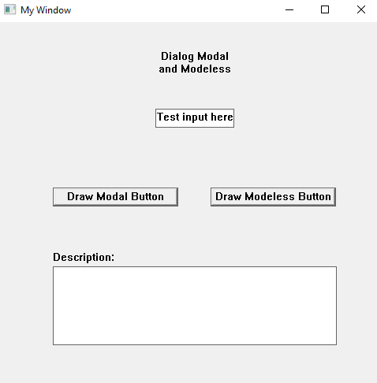
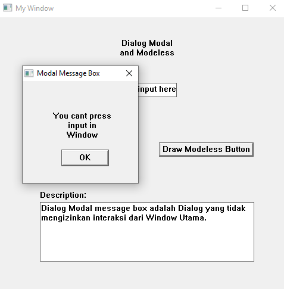
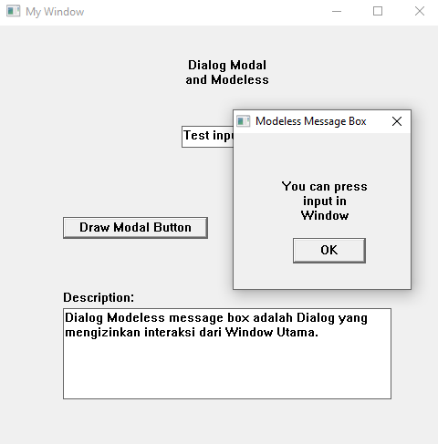

# Dialog Modal dan Modeless

## A. Deskripsi
* Dialog Modal:
    * Merupakan Message Box atau Dialog yang tidak mengizinkan interaksi di luar Message Box. Seperti 
    Mesukan input di Window Utama, atau melakukan interaksi lainnya ketika dialog muncul.

* Dialog Modeless:
    * Merupakan Message Box atau Dialog yang mengizinkan interaksi di luar Message Box. Seperti 
    Mesukan input di Window Utama, atau melakukan interaksi lainnya ketika dialog muncul.

Di dalam aplikasi ini terdapat 2 button untuk memunculkan Dialog ``Modal`` atau ``Modeless``, dan di bawahnya terdapat deskripsi berisi penjelasan ``Modal`` dan ``Modeless``. Di kedua Message Box terdapat button ``OK``, jika di tekan akan menutup Message Box. Saya akan membuat Message Box secara Manual dengan membuat 2 class Window, untuk Message Box yang di pisah dengan comment agar tidak membingungkan.

Sebenarnya terdapat cara lain yang lebih sederhana membuat Modal atau Modeless dialog dengan ``MessageBoxW();``, dan tidak perlu membuat secara manual.

* Cara Membuat Modal Message Box
    ```cpp
    MessageBoxW(hWnd, L"Ini Modal Dialog", L"Modal", MB_OK);
    ```
    > Penjelasan: Kode ini menautkan ``MessageBoxW();`` dengan ID dari Window utama ``hWnd`` sehingga tidak memungkinkan untuk interaksi dengan Window utama saat Message Box muncul.

* Cara Membuat Modeless Message Box
    ```cpp
    MessageBoxW(NULL, L"Ini Modal Dialog", L"Modeless", MB_OK);
    ```
    > Penjelasan: Kode ini tidak menautkan ``MessageBoxW();`` dengan ID dari Window utama ``NULL`` sehingga memungkinkan untuk interaksi dengan Window utama saat Message Box muncul.

Dari sini sebenarnya selesai dan cukup singkat, tetapi alangkah lebih baiknya jika kita mengetahui cara membuat Window lainya (Selain Window utama) seperti Message Box secara manual.

---

## B. Penjelasan Kode

### 1. Struktur Window Dialog

Sebelum membuat window Message Box secara manual, terlebih dahulu kita register dua buah class baru dengan:

```cpp
DialModalClass(HINSTANCE hInst);
DialModelessClass(HINSTANCE hInst);
```

Fungsi ini menggunakan struktur `WNDCLASSW` untuk mendefinisikan Window Class baru masing-masing dengan WindowProc-nya sendiri:

* `DialogModalProcedure` untuk modal
* `DialogModelessProcedure` untuk modeless

Class akan digunakan untuk membuat window Message Box custom menggunakan `CreateWindowW()`.

### 2. Membuat Dialog

#### drawDialogModal

```cpp
HWND hDialog = CreateWindowW(L"myDialogModalClass", L"Modal Message Box", WS_VISIBLE | WS_CAPTION | WS_SYSMENU, 200, 100, 200, 200, hWnd, NULL, NULL, NULL);
```

* Membuat Window baru dari class "myDialogModalClass".
* Menambahkan `STATIC` dan `BUTTON` ke dalamnya.
* Menonaktifkan Window utama dan modeless agar interaksi tertutup:

```cpp
EnableWindow(hMainWindow, false);
EnableWindow(hModelessWindow, false);
```

#### drawDialogModeless

```cpp
hModelessWindow = CreateWindowW(L"myDialogModelessClass", L"Modeless Message Box", WS_VISIBLE | WS_CAPTION | WS_SYSMENU, 200, 100, 200, 200, hWnd, NULL, NULL, NULL);
```

* Membuat Window baru dari class "myDialogModelessClass".
* Menambahkan `STATIC` dan `BUTTON` ke dalamnya.
* Tidak menonaktifkan Window utama, sehingga masih bisa diakses saat dialog muncul.

### 3. Interaksi dengan Dialog

#### Modal:

Ketika menekan button "Draw Modal Button", procedure ini dipanggil:

```cpp
drawDialogModal(hWnd);
```

Setelah window muncul, deskripsi akan ditampilkan di output menggunakan:

```cpp
SetWindowTextA(hDescOutput, DescModal.c_str());
```

#### Modeless:

Begitu juga ketika button "Draw Modeless Button" ditekan:

```cpp
drawDialogModeless(hWnd);
SetWindowTextA(hDescOutput, DescModeless.c_str());
```

### 4. Menutup Dialog

Dialog Modal maupun Modeless ditutup dengan menekan button "OK". Aksi dari button ini ditangani di masing-masing `WindowProc`:

* `EXIT_MODAL_DIALOG_BUTTON`:

```cpp
EnableWindow(hMainWindow, true);
EnableWindow(hModelessWindow, true);
SetWindowTextW(hDescOutput, L"");
DestroyWindow(hWnd);
```

* `EXIT_MODELESS_DIALOG_BUTTON`:

```cpp
SetWindowTextW(hDescOutput, L"");
DestroyWindow(hWnd);
```

---

## C. Hasil

Saat program dijalankan, akan muncul Window utama yang berisi:



* Label "Dialog Modal and Modeless"
* Input box (untuk menguji apakah aktif atau tidak ketika dialog muncul)
* Dua tombol: `Draw Modal Button` dan `Draw Modeless Button`
* Output teks yang menampilkan deskripsi dialog setelah tombol ditekan

Saat `Draw Modal Button` ditekan:



* Dialog Modal muncul
* Window utama tidak bisa diakses sampai dialog ditutup
* Deskripsi muncul di bawah

Saat `Draw Modeless Button` ditekan:



* Dialog Modeless muncul
* Window utama tetap bisa digunakan
* Deskripsi juga akan tampil di output

# 😉 Terima Kasih 😉