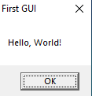

# Membuat Message Box Sederhana (Win32 API)

## A. Deskripsi

Pada proyek ini, kita akan membuat sebuah **message box** sederhana menggunakan **Win32 API**.  
Kodenya cukup singkat dan mudah dipahami. Message box ini akan menampilkan **judul** `"First GUI"` dan **pesan** `"Hello, World!"`.

## B. Penjelasan Kode

### 1. Header Win32 API

```cpp
#include <windows.h>
```

Header ini merupakan bagian dari **Win32 API** dan biasanya tersedia jika:

- Menggunakan **Visual Studio** atau sudah mengunduh SDK resmi dari Microsoft.
- Menginstal ekstensi **C/C++** dari Microsoft di VS Code.
- Menggunakan distribusi seperti **W64DevKit**.
- Sudah termasuk dalam bawaan sistem Windows.

---

### 2. Fungsi Utama: `WinMain`

```cpp
int WINAPI WinMain(HINSTANCE hInst, HINSTANCE hPrevInst, LPSTR args, int ncmdshow) {
    // Isi kode
    return 0;
}
```

- `WINAPI` (alias `__stdcall`) adalah calling convention standar di Windows, mengatur bagaimana argumen diteruskan dan nilai dikembalikan.
- `WinMain` merupakan entry point program Windows (menggantikan `main()` dalam aplikasi konsol).

#### Penjelasan Parameter `WinMain`:
- `HINSTANCE hInst`: Handle instance program saat ini, digunakan untuk mengidentifikasi aplikasi saat meminta resource ke OS.
- `HINSTANCE hPrevInst`: Digunakan untuk kompatibilitas lama (biasanya diabaikan).
- `LPSTR args`: Argumen string yang diteruskan dari command line (setara `argv`).
- `int ncmdshow`: Menentukan bagaimana window aplikasi ditampilkan saat start (misal: minimisasi, normal, dsb).

---

### 3. Membuat Message Box

```cpp
MessageBoxA(NULL, "Hello, World!", "First GUI", MB_OK);
```

Fungsi `MessageBoxA()` memiliki 4 parameter:

| Parameter           | Fungsi                                                                 |
|---------------------|------------------------------------------------------------------------|
| `HWND hWnd`         | Handle ke window induk. Diisi `NULL` karena belum membuat jendela utama. |
| `LPCSTR lpText`     | Teks yang akan ditampilkan di kotak pesan.                            |
| `LPCSTR lpCaption`  | Judul dari message box.                                               |
| `UINT uType`        | Tipe dari message box. `MB_OK` menampilkan tombol "OK" saja.          |

> **Catatan:** `MessageBoxA` adalah versi ANSI. Jika menggunakan `MessageBoxW` (versi Unicode), string harus bertipe `wchar_t` dan diberi prefix `L`, misalnya `L"Hello"`.

---

## C. Kode lengkapnya

```cpp
#include <windows.h>

int WINAPI WinMain(HINSTANCE hInst, HINSTANCE hPrevInst, LPSTR args, int ncmdshow) {
    MessageBoxA(NULL, "Hello, World!", "First GUI", MB_OK);
    return 0;
}
```

---

## D. Hasil

Berikut adalah hasil tampilan message box saat program dijalankan:



# 😉Terima Kasih😉