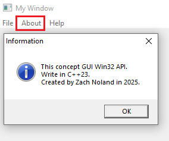

# Membuat Window dengan Menu (Win32 API)

## A. Deskripsi

Proyek ini bertujuan untuk membuat **jendela GUI** dengan **menu interaktif** menggunakan **Win32 API**. Menu terdiri dari beberapa pilihan seperti **File**, **About**, dan **Help**, yang masing-masing dapat memiliki aksi berbeda seperti membuka dialog atau keluar dari program.

---

## B. Struktur Menu (Hierarki)

Struktur menu dalam Window:

```
MyWindow
│
Menu Bar
├── File
│   ├── New
│   ├── Open
│   │   └── Item
│   └── Exit
├── About
└── Help
```

---

## C. Penjelasan Kode

### 1. Makro ID Menu

```cpp
#define FILE_MENU_NEW 1
#define FILE_OPEN_SUBMENU_ITEM 2
#define FILE_MENU_EXIT 3
#define ABOUT_MENU 4
#define HELP_MENU 5
```

Makro ini digunakan sebagai **identifier unik** untuk setiap item menu. Nilai-nilainya akan digunakan untuk menangani perintah pengguna di dalam `WindowProcedure`, khususnya pada pesan `WM_COMMAND`.

---

### 2. Membuat dan Menambahkan Menu (`addMenus`)

```cpp
void addMenus(HWND hWnd) {
    hMenu = CreateMenu();
    HMENU hFileMenu = CreateMenu();
    HMENU hSubFileMenu = CreateMenu();
```

* `CreateMenu()`: Fungsi Win32 untuk membuat objek menu kosong.
* `HMENU`: Tipe data untuk handle menu (menu utama, submenu, dsb).

```cpp
    AppendMenuW(hSubFileMenu, MF_STRING, FILE_OPEN_SUBMENU_ITEM, L"Item");
```

Menambahkan submenu "Item" ke dalam menu "Open".

```cpp
    AppendMenuW(hFileMenu, MF_STRING, FILE_MENU_NEW, L"New");
    AppendMenuW(hFileMenu, MF_POPUP, (UINT_PTR)hSubFileMenu, L"Open");
    AppendMenuW(hFileMenu, MF_SEPARATOR, NULL, NULL);
    AppendMenuW(hFileMenu, MF_STRING, FILE_MENU_EXIT, L"Exit");
```

* `MF_STRING`: Menyisipkan item menu berupa teks.
* `MF_POPUP`: Menandakan item adalah submenu.
* `MF_SEPARATOR`: Menambahkan garis pemisah.

```cpp
    AppendMenuW(hMenu, MF_POPUP, (UINT_PTR)hFileMenu, L"File");
    AppendMenuW(hMenu, MF_STRING, ABOUT_MENU, L"About");
    AppendMenuW(hMenu, MF_STRING, HELP_MENU, L"Help");

    SetMenu(hWnd, hMenu);
}
```

* `SetMenu()`: Menghubungkan menu yang telah dibuat ke window utama.

---

### 3. Menambahkan Menu Saat Window Dibuat

```cpp
case WM_CREATE:
    addMenus(hWnd);
    break;
```

Pesan `WM_CREATE` dikirim saat window selesai dibuat. Cocok digunakan untuk menambahkan elemen GUI seperti menu.

---

### 4. Menangani Aksi Menu (`WM_COMMAND`)

```cpp
case WM_COMMAND:
    switch (wp) {
        case FILE_MENU_NEW:
            MessageBeep(MB_OK);
            break;
        case FILE_MENU_EXIT:
            DestroyWindow(hWnd);
            break;
        case ABOUT_MENU:
            MessageBoxA(NULL, "This concept GUI Win32 API.\nWrite in C++23.\nCreated by Zach Noland in 2025.", "Information", MB_ICONINFORMATION);
            break;
        case HELP_MENU:
            MessageBoxA(NULL, "Notes: No help or Tutorial.\nJust Empty Window with Menus.", "Help", MB_HELP);
            break;
    }
    break;
```

Penjelasan aksi berdasarkan `wp` (Word Parameter):

* `FILE_MENU_NEW`: Menghasilkan suara beep.
* `FILE_MENU_EXIT`: Menutup window.
* `ABOUT_MENU`: Menampilkan pesan informasi.
* `HELP_MENU`: Menampilkan pesan bantuan.

Penjelasan preprocessor ``MB_`` di parameter ``MessageBoxA();``:

* ``MB_ICONINFORMATION`` merupakan preprocessor untuk tipe dari ``MessageBoxA();`` berupa tampilan informasi.
* ``MB_HELP`` merupakan preprocessor untuk tipe dari ``MessageBoxA();`` berupa tampilan help.      

#### Penjelasan `MessageBeep()`

```cpp
MessageBeep(MB_OK);
```

* Fungsi `MessageBeep()` digunakan untuk memutar suara sistem.
* Parameter `MB_OK` menentukan jenis suara yang diputar — dalam hal ini suara standar untuk Message Box dengan tombol OK.
* Fungsi ini tidak menampilkan dialog apa pun, hanya memicu suara sebagai respon terhadap aksi pengguna.

---

### 5. Fungsi `WindowProcedure`

```cpp
LRESULT CALLBACK WindowProcedure(HWND hWnd, UINT msg, WPARAM wp, LPARAM lp) {
    switch (msg) {
        case WM_COMMAND:
        case WM_CREATE:
        case WM_DESTROY:
            // Penanganan telah dijelaskan di bagian sebelumnya
            break;
        default:
            return DefWindowProcW(hWnd, msg, wp, lp);
    }
    return DefWindowProcW(hWnd, msg, wp, lp);
}
```

#### Penjelasan Parameter:

| Parameter   | Deskripsi                                                                    |
| ----------- | ---------------------------------------------------------------------------- |
| `HWND hWnd` | Handle ke window tujuan pesan.                                               |
| `UINT msg`  | Jenis pesan yang dikirim oleh sistem atau pengguna.                          |
| `WPARAM wp` | Parameter tambahan, biasanya menyimpan ID menu atau informasi status tombol. |
| `LPARAM lp` | Parameter tambahan lainnya, sering kali menyimpan pointer atau koordinat.    |

---

## D. Kode lengkapnya

```cpp
#include <windows.h>

#define FILE_MENU_NEW 1
#define FILE_OPEN_SUBMENU_ITEM 2
#define FILE_MENU_EXIT 3
#define ABOUT_MENU 4
#define HELP_MENU 5

LRESULT CALLBACK WindowProcedure(HWND, UINT, WPARAM, LPARAM);

void addMenus(HWND);

HMENU hMenu;

int WINAPI WinMain(HINSTANCE hInst, HINSTANCE hPrevInst, LPSTR args, int ncmdshow) {
    
    WNDCLASSW wc = {0};
    wc.hbrBackground = reinterpret_cast<HBRUSH>(COLOR_WINDOW);
    wc.hCursor = LoadCursor(NULL, IDC_ARROW);
    wc.hInstance = hInst;
    wc.lpszClassName = L"firstWindowClass";
    wc.lpfnWndProc = WindowProcedure;

    if (!RegisterClassW(&wc)) {
        return -1;
    }

    CreateWindowW(L"firstWindowClass", L"My Window", WS_OVERLAPPEDWINDOW | WS_VISIBLE, 100, 100, 500, 500, NULL, NULL, NULL, NULL);

    MSG msg = {0};

    while (GetMessageW(&msg, NULL, static_cast<UINT>(NULL), static_cast<UINT>(NULL))) {
        TranslateMessage(&msg);
        DispatchMessage(&msg);
    }

    return 0;
}

LRESULT CALLBACK WindowProcedure(HWND hWnd, UINT msg, WPARAM wp, LPARAM lp) {

    switch (msg) {

        case WM_COMMAND:
            switch (wp) {

                case FILE_MENU_NEW:
                    MessageBeep(MB_OK);
                break;

                case FILE_MENU_EXIT:
                    DestroyWindow(hWnd);
                break;

                case ABOUT_MENU:
                    MessageBoxA(NULL, "This concept GUI Win32 API.\nWrite in C++23.\nCreated by Zach Noland in 2025.", "Information", MB_ICONINFORMATION);
                break;

                case HELP_MENU:
                    MessageBoxA(NULL, "Notes: No help or Tutorial.\nJust Empty Window with Menus.", "Help", MB_HELP);
                break;

            }
        break;

        case WM_CREATE:
            addMenus(hWnd);
        break;

        case WM_DESTROY:
            PostQuitMessage(0);
            return 0;
        break;

        default:
            return DefWindowProcW(hWnd, msg, wp, lp);
    }
    return DefWindowProcW(hWnd, msg, wp, lp);
}

void addMenus(HWND hWnd) {
    hMenu = CreateMenu();
    HMENU hFileMenu = CreateMenu();
    HMENU hSubFileMenu = CreateMenu();

    AppendMenuW(hMenu, MF_POPUP, reinterpret_cast<UINT_PTR>(hFileMenu), L"File");

    AppendMenuW(hFileMenu, MF_STRING, FILE_MENU_NEW, L"New");
    
    AppendMenuW(hFileMenu, MF_POPUP, reinterpret_cast<UINT_PTR>(hSubFileMenu), L"Open");
    AppendMenuW(hSubFileMenu, MF_STRING, FILE_OPEN_SUBMENU_ITEM, L"Item");
    
    AppendMenuW(hFileMenu, MF_SEPARATOR, static_cast<UINT_PTR>(NULL), NULL);
    AppendMenuW(hFileMenu, MF_STRING, FILE_MENU_EXIT, L"Exit");

    AppendMenuW(hMenu, MF_STRING, ABOUT_MENU, L"About");
    AppendMenuW(hMenu, MF_STRING, HELP_MENU, L"Help");

    SetMenu(hWnd, hMenu);
}
```

---

## E. Hasil

Jendela akan menampilkan menu bar dengan hierarki seperti berikut:


Menu dapat diklik dan akan memicu aksi tertentu.




> Note: Menu ``New`` di dalam ``File`` dapat di tekan dan mengeluarkan suara dari ``MB_OK``.

# 😉 Terima Kasih 😉
