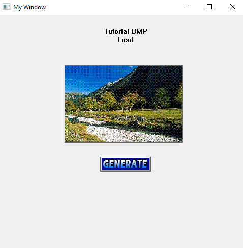

# Membuat Aplikasi Menampilkan Gambar Bitmap (Win32 API)

## A. Deskripsi

Proyek ini merupakan contoh aplikasi GUI menggunakan **Win32 API** yang menampilkan file **bitmap (BMP)** ke dalam window. Gambar ditampilkan dalam bentuk kontrol `STATIC` dan juga digunakan sebagai gambar untuk tombol (`BUTTON`).

---

## B. Penjelasan Kode

### 1. Komponen Global

```cpp
HWND hLandscape1;
HBITMAP hGenerateImage, hLandscape1Image;
```

* `hLandscape1`: Handle untuk kontrol `STATIC` yang akan digunakan untuk menampilkan gambar landscape.
* `hLandscape1Image`: Handle untuk objek `HBITMAP` yang berisi gambar bitmap landscape.
* `hGenerateImage`: Handle untuk objek `HBITMAP` yang berisi gambar bitmap tombol.

---

### 2. Fungsi loadImage

```cpp
void loadImage() {
    hLandscape1Image = (HBITMAP) LoadImageW(NULL, L"img\\landscape1.bmp", IMAGE_BITMAP, 230, 150, LR_LOADFROMFILE);
    hGenerateImage = (HBITMAP) LoadImageW(NULL, L"img\\generate.bmp", IMAGE_BITMAP, 100, 65, LR_LOADFROMFILE);
}
```

`LoadImageW()`: Digunakan untuk memuat gambar dari file `.bmp` ke dalam memori sebagai objek `HBITMAP`.

#### Isi parameter function `LoadImageW()`.

| Parameter         | Penjelasan                                                               |
| ----------------- | ------------------------------------------------------------------------ |
| `LPCWSTR L"img\\image.bmp"` | Merupakan parameter untuk lokasi path dari gambar ``.bmp`` yang di ambil saat run executable. |
| `IMAGE_BITMAP` | Menandakan bahwa tipe file yang dimuat adalah bitmap.                       |
| `int cx` dan `int cy` | Nilai width dan height disesuaikan sesuai kebutuhan layout tampilan. |
| `LR_LOADFROMFILE` | Menyatakan bahwa sumber gambar berasal dari file, bukan resource.        |

---

### 3. Fungsi addControl

```cpp
void addControl(HWND hWnd);
```

Menambahkan kontrol `STATIC` dan `BUTTON` untuk menampilkan gambar.

```cpp
hLandscape1 = CreateWindowW(L"STATIC", NULL, WS_VISIBLE | WS_CHILD | WS_BORDER | SS_BITMAP, ...);
SendMessageW(hLandscape1, STM_SETIMAGE, IMAGE_BITMAP, (LPARAM)hLandscape1Image);
```

* `SS_BITMAP`: Style untuk kontrol `STATIC` agar dapat menampilkan gambar.
* `STM_SETIMAGE`: Digunakan untuk menetapkan image ke kontrol `STATIC`.

```cpp
HWND hBut = CreateWindowW(L"BUTTON", NULL, WS_VISIBLE | WS_CHILD | WS_BORDER | BS_BITMAP, ...);
SendMessageW(hBut, BM_SETIMAGE, IMAGE_BITMAP, (LPARAM)hGenerateImage);
```

* `BS_BITMAP`: Style untuk `BUTTON` agar dapat menampilkan gambar.
* `BM_SETIMAGE`: Mengatur gambar sebagai tampilan tombol.

---

## C. Hasil

Window akan menampilkan:



* Sebuah gambar bitmap `landscape1.bmp` pada kontrol `STATIC`.
* Sebuah tombol bergambar `generate.bmp`.

> Pastikan file `landscape1.bmp` dan `generate.bmp` berada pada folder `img/` sesuai dengan path yang telah ditentukan. Salin folder ``img/`` ke dalam bin saat mau run ``main.exe``, Tetapi jika di run `main.exe` berada di folder project `6.CreateBmpImage` tidak perlu salin folder `img/`.

# 😉 Terima Kasih 😉
