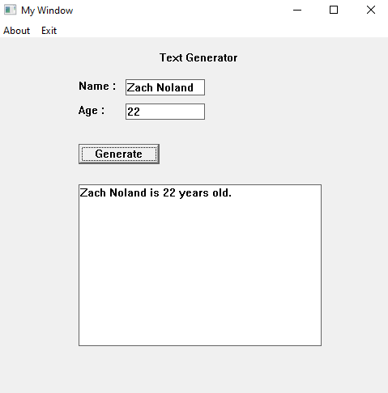
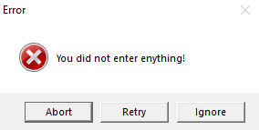
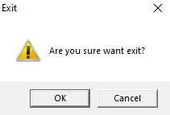

# Membuat Aplikasi Text Generator dengan Validasi dan MessageBox (Win32 API)

## A. Deskripsi

Program ini merupakan pengembangan dari aplikasi **Text Generator** menggunakan **Win32 API**, di mana pengguna dapat memasukkan **Name** dan **Age** melalui input box, kemudian menampilkan kalimat hasil gabungan seperti:

```
Zach Noland is 22 years old.
```

Program ini juga menambahkan fitur validasi input dan penggunaan **MessageBox** dengan berbagai tipe tombol dan ikon seperti:

* `MB_OKCANCEL`
* `MB_ABORTRETRYIGNORE`
* `MB_ICONERROR`, dll.

Aplikasi ini tidak hanya menampilkan hasil dari input, tetapi juga memverifikasi input terlebih dahulu dan memberi pengalaman interaktif dengan berbagai jenis MessageBox untuk memperingatkan atau meminta konfirmasi pengguna.

---

## B. Penjelasan Tipe Message Box 

### 1. Tipe Button Message Box

| Preprocessor Message Box | Penjelasan                                                               |
| ------------------------ | ------------------------------------------------------------------------ |
| ``MB_OK``                | Message Box yang hanya memiliki button **Ok** Saja.                      |  
| ``MB_OKCENCEL``          | Message Box yang memiliki button **Ok** dan **Cencel**.                  |
| ``MB_RETRYCANCEL``       | Message Box yang memiliki button **Retry** dan **Cancel**.               | 
| ``MB_YESNO``             | Message Box yang memiliki button **Yes** dan **No**.                     |
| ``MB_YESNOCANCEL``       | Message Box yang memiliki button **Yes**, **No**, dan **Cancel**.        |
| ``MB_HELP``              | Message Box yang memiliki button **Ok** dan **Help**.                    |
| ``MB_ABORTRETRYIGNORE``  | Message Box yang memiliki button **Abort**, **Retry**, dan **Ignore**.   |    
| ``MB_CANCELTRYCONTINUE`` | Message Box yang memiliki button **Cancel**, **Try**, dan **Continue**.  |                    

---

### 2. ID dari Button Message Box

| Preprocessor ID Button 	| Integer ID |
| -----------------------	| -------- |
| ``IDOK``					| 1			 |
| ``IDCANCEL``				| 2			 |
| ``IDABORT``				| 3			 |
| ``IDRETRY``				| 4			 |
| ``IDIGNORE``				| 5			 |
| ``IDYES``					| 6			 |
| ``IDNO``					| 7			 |
| ``IDTRYAGAIN``			| 10		 |
| ``IDCONTINUE``			| 11		 |

---

### 3. Icon Message Box

| Icon| Preprocessor ``#define``      				   			| Penjelasan                |
| --- | ------------------------------------------------------- | ------------------------  |
| ❔ | ``MB_ICONQUESTION``                              			| Icon dari pertanyaan.     | 
| ❕ |  ``MB_ICONASTERISK`` atau ``MB_ICONINFORMATION`` 			| Icon dari Informasi.      |
| ⚠ | ``MB_ICONEXCLAMATION`` atau ``MB_ICONWARNING`` 		    | Icon dari peringatan.	    |
| ❌ | ``MB_ICONHAND``, ``Mb_ICONSTOP``, atau ``MB_ICONERROR``	| Icon dari error.  		|

---

## C. Penjelasan Kode

### 1. Event EXIT\_MENU dengan MessageBox Konfirmasi

```cpp
int idExitMenu;
idExitMenu = MessageBoxW(hWnd, L"Are you sure want exit?", L"Exit", MB_OKCANCEL | MB_ICONWARNING);

if (idExitMenu == IDOK) {
    DestroyWindow(hWnd);
}
```

* `MB_OKCANCEL`: Menampilkan tombol OK dan Cancel.
* `MB_ICONWARNING`: Menampilkan ikon peringatan.
* `IDOK`: Konstanta untuk mendeteksi jika pengguna memilih tombol OK.

### 2. Event GENERATE\_BUTTON dengan Validasi Input

```cpp
if ((Name == "") || (Age == "")) {
    idCheckBtn = MessageBoxW(hWnd, L"You did not enter enything!", L"Error", MB_ABORTRETRYIGNORE | MB_ICONERROR);
```

* `MB_ABORTRETRYIGNORE`: Menampilkan tiga pilihan tombol.
* `MB_ICONERROR`: Ikon pesan kesalahan.
* Digunakan untuk memberi tahu pengguna jika input kosong.

### 3. Respon terhadap Pilihan MessageBox

```cpp
switch (idCheckBtn) {
    case IDABORT:
        DestroyWindow(hWnd);
        break;

    case IDRETRY:
        Output = "No Output";
        SetWindowTextA(hName, "");
        SetWindowTextA(hAge, "");
        SetWindowTextA(hOutput, Output.c_str());
        return 0;

    case IDIGNORE:
        Output = "Error: Name or Age its Empty!";
        SetWindowTextA(hOutput, Output.c_str());
        return 0;
}
```

* `IDABORT`: Keluar dari aplikasi.
* `IDRETRY`: Membersihkan input dan mengatur teks default.
* `IDIGNORE`: Melanjutkan meskipun input kosong.

### 4. Output Kalimat

```cpp
Output = Name + " is " + Age + " years old.";
SetWindowTextA(hOutput, Output.c_str());
```

* String digabung menggunakan operator `+`.
* `SetWindowTextA()`: Menampilkan hasil ke dalam `EDIT` box.
* `c_str()`: Mengubah `std::string` menjadi `const char*`.

---

## D. Message Tambahan

```cpp
MessageBeep(MB_OK);
```

Memberikan efek suara setelah tombol Generate ditekan.

---

## E. Hasil

Saat dijalankan dan di gunakan, aplikasi menampilkan:



* Label "Text Generator" dan input field `Name` dan `Age` untuk memasukan input.
* Tombol **Generate** untuk generate hasil.
* Output akan ditampilkan dalam `EDIT` box besar, berisi output text.

### Contoh interaksi:

* Jika input kosong:

  * Dialog error akan muncul:

    

    * **Abort**: Menutup aplikasi.
    * **Retry**: Mengosongkan input dan output.
    * **Ignore**: Menampilkan pesan error ke output: `Error: Name or Age its Empty!`

* Menu:

  * **About**: Menampilkan MessageBox dengan informasi aplikasi.
  * **Exit**: Menampilkan dialog konfirmasi untuk keluar.

  * Jika tekan ``Exit``:

    * Dialog error akan muncul:

      

      * **OK**: Menutup aplikasi.
      * **Cancel**: Kembali ke aplikasi.

---

# 😉 Terima Kasih 😉