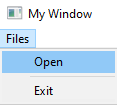

# Membuat Menu Open File

## A. Deskripsi

Program ini merupakan aplikasi GUI berbasis **Win32 API** yang memungkinkan pengguna untuk membuka dan membaca isi file teks atau file kode C/C++ langsung dari GUI. Aplikasi menampilkan isi file ke dalam `EDIT control` dan juga menampilkan path file yang sedang dibuka.

Di Window utama terdapat 4 Komponen:

* 2 komponen `STATIC` sebagai label:

  * "File Viewer" (judul utama di atas)
  * "File Path:" (penanda untuk path file)
* 2 komponen `EDIT`:

  * Area isi file (`hInFile`)
  * Path file (`hPathFile`)

Terdapat menu "Files" di menu bar, yang memiliki dua opsi:

* **Open**: Menampilkan dialog pemilihan file (`OPENFILENAME`) untuk membuka file.
* **Exit**: Menutup aplikasi.

---

## B. Penjelasan Kode

### 1. Fungsi `openFileMenu(HWND hWnd)`

Fungsi ini bertugas untuk membuka dialog file menggunakan `OPENFILENAMEA`, lalu membaca isi file menggunakan `fileOpenAndRead()` jika file berhasil dipilih.

```cpp
std::vector<char> fileName(100);
OPENFILENAMEA openfn;
ZeroMemory(&openfn, sizeof(openfn));

openfn.lStructSize = sizeof(openfn);
openfn.hwndOwner = hWnd;
openfn.lpstrFile = fileName.data();
openfn.lpstrFile[0] = '\0';
openfn.nMaxFile = fileName.size();
openfn.lpstrFilter = "All file\0*.TXT;*.C;*.CPP\0Text file\0*.TXT\0C/C++ code file\0*.C;*.CPP\0";
openfn.nFilterIndex = 1;
GetOpenFileNameA(&openfn);
fileOpenAndRead(hWnd, openfn.lpstrFile);
SetWindowTextA(hPathFile, openfn.lpstrFile);
```

#### Fungsi `ZeroMemory();`

```cpp
ZeroMemory(&openfn, sizeof(openfn));
```

Digunakan untuk menginisialisasi seluruh isi dari struct `OPENFILENAMEA` dengan nilai 0 (`0x00`). Ini penting untuk menghindari nilai sampah (garbage values) pada field yang tidak di-set secara manual.

##### Parameter:

* `&openfn`: Alamat dari struct yang akan dibersihkan.
* `sizeof(openfn)`: Jumlah byte dari struct yang ingin di-reset.

> Alternatif fungsi ini adalah `memset(&openfn, 0, sizeof(openfn))`, namun `ZeroMemory` lebih disarankan dalam konteks WinAPI.

### Struktur dan Member `OPENFILENAMEA`

```cpp
OPENFILENAMEA openfn;
```

Struct `OPENFILENAMEA` digunakan sebagai konfigurasi dialog open file.

#### Penjelasan Member yang Digunakan:

| Member         | Deskripsi                                                                              |
| -------------- | -------------------------------------------------------------------------------------- |
| `lStructSize`  | Ukuran byte dari struct `OPENFILENAMEA`. Harus di-set menggunakan `sizeof(openfn)`.    |
| `hwndOwner`    | Handle ke window utama. Menjadikan dialog anak dari window utama.                      |
| `lpstrFile`    | Buffer yang akan diisi dengan path file yang dipilih. Diatur dengan `fileName.data()`. |
| `lpstrFile[0]` | Inisialisasi awal string menjadi kosong agar tidak muncul teks default di dialog.      |
| `nMaxFile`     | Panjang maksimal dari buffer `lpstrFile`. Biasanya sama dengan `fileName.size()`.      |
| `lpstrFilter`  | Filter ekstensi file yang dapat dipilih. Format: `DisplayName\0FilterPattern\0...\0`.  |
| `nFilterIndex` | Index filter default yang dipilih pertama kali. (1 = All file).                        |

### Format Filter (`lpstrFilter`)

```cpp
"All file\0*.TXT;*.C;*.CPP\0Text file\0*.TXT\0C/C++ code file\0*.C;*.CPP\0"
```

Artinya:

* All file → \*.TXT;\*.C;\*.CPP
* Text file → \*.TXT
* C/C++ code file → \*.C;\*.CPP
> Catatan: untuk membuat gabungan format bisa menggunakan semi kolon `;`, seperti `\0*.TXT;*.CPP\0`.

---

### 2. Fungsi `fileOpenAndRead(HWND hWnd, std::string pathFile)`

Fungsi ini membuka file dalam mode binary (`std::ios::binary`) dan membaca seluruh isinya menggunakan `std::istreambuf_iterator`, kemudian menampilkan hasilnya pada `EDIT control`.

```cpp
std::fstream userfile(pathFile, std::ios::in | std::ios::binary);
std::string Text((std::istreambuf_iterator<char>(userfile)), std::istreambuf_iterator<char>());
SetWindowTextA(hInFile, Text.c_str());
```

---

### 3. Menu Bar: `addMenus(HWND hWnd)`

```cpp
AppendMenuW(hMenu, MF_POPUP, ..., L"Files");
AppendMenuW(hOpenFiles, MF_STRING, OPEN_FILE_MENU, L"Open");
AppendMenuW(hOpenFiles, MF_STRING, EXIT_FILE_MENU, L"Exit");
```

Menambahkan menu "Files" ke menu bar dan submenu "Open" serta "Exit" ke dalamnya.

---

### 4. Area Tampilan File dan Path: `addControl(HWND hWnd)`

```cpp
hInFile = CreateWindowW(L"EDIT", ..., ES_MULTILINE | ES_AUTOVSCROLL);
hPathFile = CreateWindowW(L"EDIT", ..., ES_AUTOHSCROLL);
```

* `hInFile`: Menampilkan isi dari file.
* `hPathFile`: Menampilkan path file yang dipilih.

---

## C. Hasil

* Ketika program dijalankan:


* Ketika menekan menu `Files` terdapat 2 opsi `Open` dan `Exit`.



* Menekan menu `Open` akan membuka **File Menu Dialog**

.png)

* Di samping kanan bawah terdapat pilihan **Filter Format**, saya memilih ``All Files`` yang mencakup format ``*.txt``, ``*.c``, dan ``*.cpp``.


* Saya memilih file ``todoListToday.txt`` dan menekan ``OK``. Maka akan muncul isi dari file yang di pilih.

.png)

---

# 😉 Terima Kasih 😉